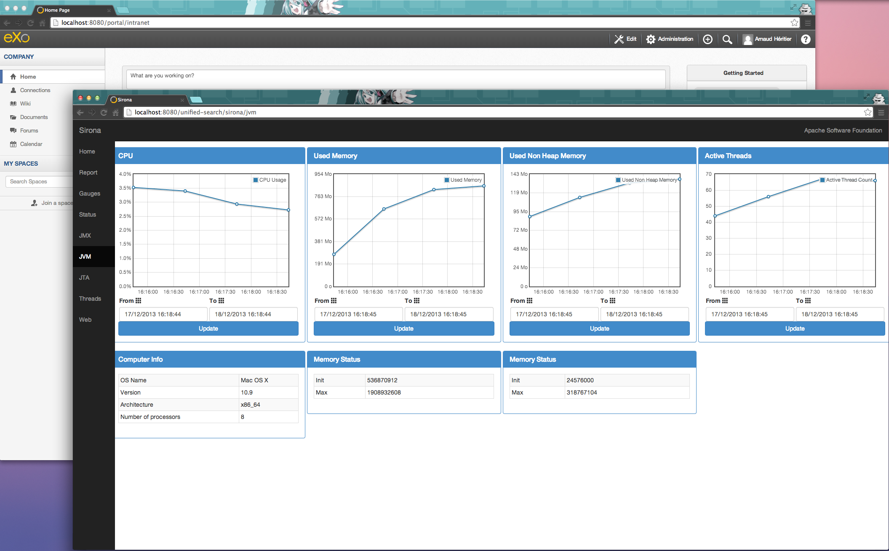
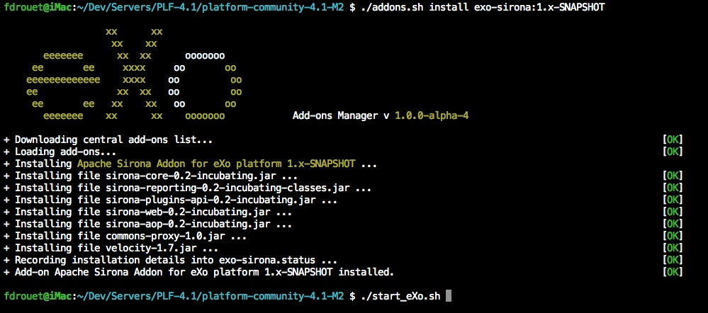

eXo Sirona add-on
============

The add-on integrate [Apache Sirona](http://sirona.incubator.apache.org/) monitoring system (screens and probes) into eXo platform 4

# Prerequisites

* a working eXo Platform 4+ installation ([Community](http://community.exoplatform.com/portal/intranet/downloads), [Express or Enterprise](http://www.exoplatform.com/company/en/products/editions))

# How-to install 

## for eXo Platform 4.0.x (prior to eXo Platform 4.1 RC1)

1- Install the [eXo Platform add-on manager](http://blog.exoplatform.com/en/2013/12/20/boost-platform-new-add-ons-manager) in your existing eXo Platform 4.x if it is not already done :

    cd <EXOPLATFORM_HOME>
    curl -L -o addons-manager-1.0.0-alpha-4.zip http://sourceforge.net/projects/exo/files/Addons/Add-ons%20Manager/addons-manager-1.0.0-alpha-4.zip/download
    unzip addons-manager-1.0.0-alpha-4.zip

2- Then install the eXo Sirona add-on with the following command

    # for the last STABLE version
    ./addons.sh install exo-sirona
    
    # for the last DEVELOPMENT version
    ./addons.sh install exo-sirona:1.x-SNAPSHOT 

3- Start your eXo Platform 4 and go to [http://localhost:8080/sirona/]() ...

## for eXo Platform 4.1-RC1+

1- Then install the eXo Sirona add-on with the following command

    # for the last STABLE version
    ./addons.sh install exo-sirona
    
    # for the last DEVELOPMENT version
    ./addons.sh install exo-sirona:1.x-SNAPSHOT 

2- Start your eXo Platform 4 and go to [http://localhost:8080/sirona/]() ...

# Configuration

To configure Sirona or for any other informations on it, please go to [Apache Sirona website](http://sirona.incubator.apache.org/).
